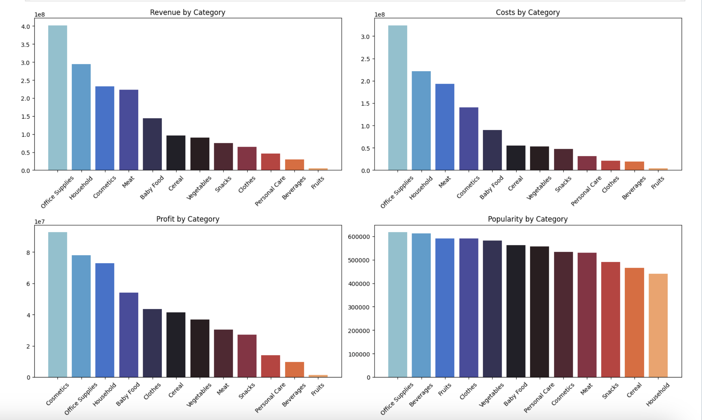

# Exploratory data analysis for online store

## Project Description

This project focuses on cleaning and analyzing sales data using Python.  
The goal was to prepare raw data for analysis, explore key business metrics and uncover insights related to profitability, demand, and logistics.

This project was completed as a learning (pet) project.

---

## Data

The dataset consists of three tables:

- **products** — contains product ID and product name  
- **countries** — includes country information (name, region, subregion, ISO-2 and ISO-3 codes)  
- **events** — the main orders table:
  - Order ID  
  - Order Date  
  - Ship Date  
  - Order Priority  
  - Country Code  
  - Product ID  
  - Sales Channel  
  - Units Sold  
  - Unit Price  
  - Unit Cost  

## Data Cleaning

The following steps were performed:
- Fixed data types for Order Date and Ship Date
- Handled missing values:
  - countries — <0.4% missing → removed  
  - events (Units Sold) — ~0.15% → removed  
  - events (Country Code) — ~6.17%:
    - checked for systematic issues  
    - missing values were random  
- Data preserved using LEFT JOIN to avoid data loss  
- Validated:
  - no negative values  
  - logical date consistency  
  - no critical outliers  

## Key Metrics

- Number of orders: **1,328**  
- Total profit: **501,434,459**  
- Number of countries: **45**  
- Number of active regions: **2**

After merging the tables, it was discovered that sales occurred only in 2 out of 5 possible regions.

## Key Insights

### Category Profitability

- The most profitable categories are Cosmetics, Office Supplies, and Household — they also generate the highest revenue.  
- Fruits and Beverages are among the most popular categories but have low margins.

### Sales Geography

- The top 10 countries by revenue are dominated by Eastern European countries.  
- The highest revenue comes from:
  - Czech Republic
  - Ukraine
  - Bosnia and Herzegovina

### Sales Channels

- Revenue is relatively evenly distributed between channels  
- Slight dominance of offline sales is observed  

### Logistics

- Longest delivery time (~27 days): Cereals, Office Supplies 
- Fastest delivery: Clothing, Personal Care  

**Geographical factor:**
- No strong dependency identified  
- However, countries with sea access tend to have slightly faster delivery  

### Delivery Time

- Median delivery time in both regions is ~25 days  
- Europe:
  - 25% of deliveries ≤ 12 days  
  - 75% ≤ 38 days  
- Asia:
  - 25% ≤ 16 days  
  - 75% ≤ 36 days  

- Outliers exist in both directions:
  - max delivery time: ~50 days  
  - min: 0–1 day  

- No correlation between shipping time and profit was found  

### Sales Behavior & Seasonality

- Cereals, Fruits, Vegetables show wavering due to harvest seasonality  
- Cosmetics and Household peak during the pre-holiday period  
- Clothing peaks in summer, Meat in spring  
- Fruits show stable, slightly growing profit, while Cosmetics trend downward overall (with some country exceptions)  
- Sales peak from Friday to Monday, with a decline to midweek  

## Technologies

- Python (pandas, numpy, matplotlib, seaborn)  
